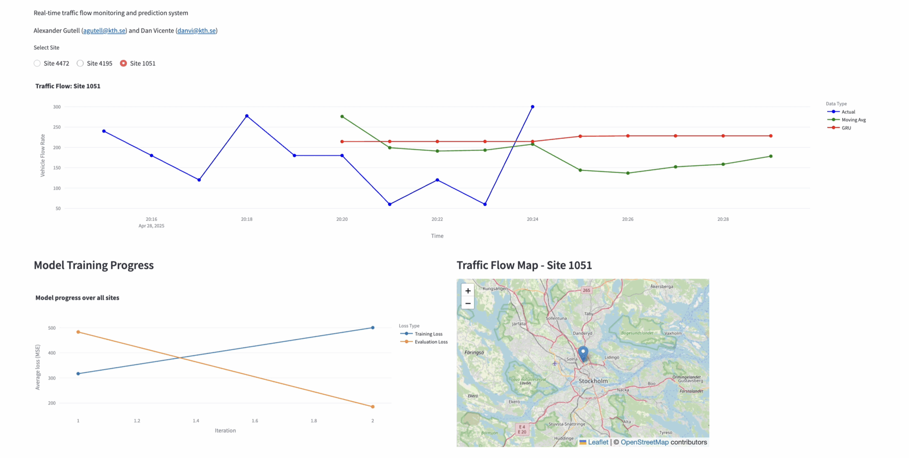
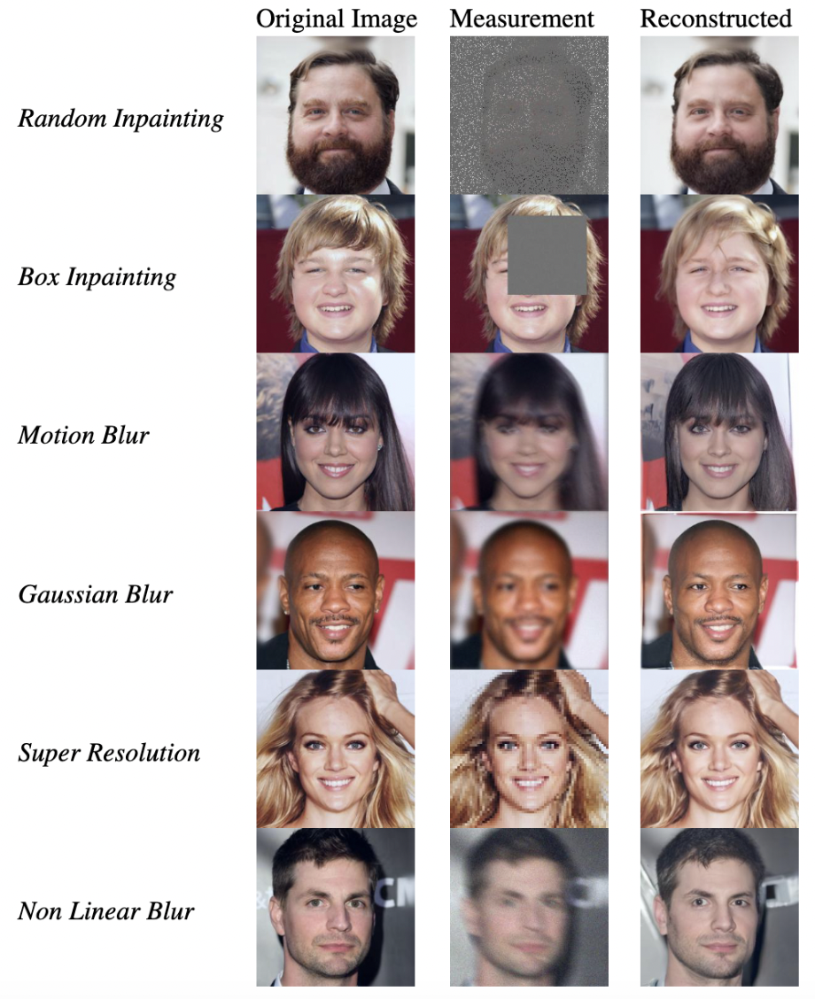

# Real-time Traffic Monitoring and Prediction of Traffic Flow

This project was developed to gain experience in Dockerized applications and analysis of real-time streaming time series data. We built an end-to-end application that:

* Collects real-time traffic data from Trafikverket's API through a Kafka producer
* Processes streaming data using Apache Kafka
* Performs real-time analysis and feature engineering with PySpark
* Forecasts traffic conditions five minutes into the future using:
  * An autoregressive Gated Recurrent Unit (GRU) built using PyTorch
  * An autoregressive Moving Average model for prediction and comparison

Visualizes both current traffic conditions and predictions in an interactive dashboard

**Code** is available at: [GitHub Repository](https://github.com/agutell/traffic-monitoring-and-prediction)

# [Re] Diffusion Posterior Sampling for Noisy Inverse Problems

This paper aims to reproduce the experiments presented in Chung et al. [2023],
where the authors propose a sampling technique for solving inverse problems with
diffusion models as priors. Our re-implementation successfully reproduces the
results to a satisfactory extent based on the information provided in the original
paper, though with worse FID, LPIPS, SSIM, and PSNR scores compared to the
reported benchmarks. Additionally, we extend the original implementation by
incorporating a fast sampling algorithm for diffusion models, DPM-Solver Lu et al.
[2024]. Further, we conduct several additional experiments, including ablation
studies on mask size for Random and Box Inpainting, and perform an in-depth
statistical analysis of LPIPS scores to better understand the model’s performance
and limitations.

**Code** is available at: [GitHub Repository](https://github.com/KTH-DD2412-Project-Group-18/diffusion_posterior_sampling)

**PDF** is available at: [view](https://github.com/agutell/Projects/blob/main/%5BRe%5D%20Diffusion%20Posterior%20Sampling%20for%20Noisy%20Inverse%20Problems.pdf)

# Contrast to the Past - Autoregressive Contrastive Temporal Knowledge Graph Extrapolation
Graphs are fundamental across various fields, representing complex relationships and structures — such as social
networks, chemical bonds, and even neural networks in machine learning. Knowledge graphs extend this concept to organize real world information into entities and relationships, structuring facts in interconnected ways. However, traditional knowledge graphs lack temporal context, limiting their ability to capture the evolution of information over time. Temporal Knowledge Graphs (TKGs) address this by adding a temporal dimension, enabling dynamic analysis and prediction of future events by tracking how interactions evolve across timestamps. This project seeks to improve the RE-GCN model for extrapolation tasks on TKGs, specifically for predicting events involving unseen entities or relationships. By integrating a contrastive learning framework inspired by the CENET model, our approach enhances RE-GCN’s ability to distinguish historical from non-historical dependencies, which in turn improves predictive accuracy on complex, dynamic datasets. Experimental results on the ICEWS18 dataset demonstrate that our modifications to RE-GCN lead to unchanged accuracy in capturing both historical and non-historical dependencies. These results underscore the complexity of modeling diverse temporal patterns within TKGs and highlight areas for further refinement, such as improved calibration techniques and extensions for uncertainty quantification.

**PDF** is available at: [view](https://github.com/agutell/Projects/blob/main/Contrast%20to%20the%20Past%20-%20Autoregressive%20Contrastive%20Temporal%20Knowledge%20Graph%20Extrapolation.pdf)

# Explainable Machine Learning in Cardiovascular Diagnostics
Bachelor Thesis at KTH: Explainable Machine Learning in Cardiovascular
Diagnostics

The major challenges in implementing machine
learning models in medical applications stem from ethical and
accountability concerns, which arise from the lack of insight
and understanding of the models’ inner workings and reasoning. This opaqueness has resulted in the emergence of a
new subfield of machine learning called Explainability, which
aims to develop and deploy methods to gain insight into how
input data is weighted and propagated through a machine
learning algorithm. This paper aims to examine the viability
of certain explainability methods when applied to cardiovascular
diagnostics. The machine learning models that were implemented
and subsequently evaluated include Logistic Regression, Decision
Trees, and Random Forests. Methods such as Feature Importance
plots, Lasso Regularization (L1 norm), and Sequential Feature
Selection were applied to achieve better interpretation of these
models. The results indicate that different models and forms
of regularization prioritize various input features more heavily
than others, even when trained on identical data. A consistent
finding across all models, except for Logistic Regression with
Lasso regularization, was the ability to significantly reduce the
dimensionality of the input feature space without substantial
loss in model test performance. This allows for the isolation of
specific features, thereby enhancing insight into and improving
a model’s interpretability. Systolic and diastolic blood pressure
along with cholesterol values were the two main input features
that determined a patients cardiovascular diagnosis.

**PDF** is available at: [view](https://github.com/agutell/Projects/blob/main/Explainable%20Machine%20Learning%20in%20Cardiovascular%20Diagnostics.pdf)

# Quantization and Finetuning of LLMs
In this work we tried to fine-tune large language models on a summarization task on a wikihow dataset. More precisely, we made our experimentations with Mistral-7B and LLama-2-7B. We used different parameter efficient tuning techniques such as QLoRA to be able to run the computations on limited resources. We proceeded to a hyper-parameter comparison on the low-rank adapter parameters, and used the best model for our final tuning. We found that descent results could be achieved, even with few steps of training, and with a low adapter rank.

**Code** is available at: [GitHub Repository](https://github.com/agutell/Quantization-and-Finetuning-of-LLMs)

**PDF** is available at: [view](https://github.com/agutell/Projects/blob/main/Quantization%20and%20Finetuning%20of%20LLMs.pdf)

# Transfer Learning - A Deep Learning Approach
The paper explores transfer learning together with pseudo labeling and semi-supervised learning.

Deep learning models have helped us in accomplishing many feats in modern
society. Although state-of-the-art models such as ChatGPT, DALL-E and VALL-E
are the best in their fields, they are also computationally expensive and require an
abundant amount of resources. One solution is to make use of transfer learning,
a method that utilizes a pre-trained model as a starting point to solve a similar
task. Through this method, fewer resources are required and can also improve
generalization.
Similarly to many other deep learning approaches, transfer learning requires labeled
data. The process of manually labeling data is both time-consuming and laborintensive.
In the last decade, however, semi-supervised learning has become a hot
topic to relieve the need for labeled data. This method of training models trains on
labeled data and exploits unlabeled data to further improve learning performance.
One such method is known as pseudo-labeling. This method has gained popularity
and attention in recent times.
This report analyzes an implementation of transfer learning on Oxford’s pet dataset.
In addition, a thorough analysis of semi-supervised learning using pseudo-labeling
as an extension to this project will be performed. The final test accuracy on the
multi-classification task was 93.5% which suggests the model classifies the classes
well. In comparison to other existing models, it seems visual transformers perform
better than ResNets in this task. The results from semi-supervised learning indicate
that pseudo-labeling improves the performance if the amount of labeled data is
limited but more experiments and other variants of this approach should be further
test.

**PDF** is available at: [view](https://github.com/agutell/Projects/blob/main/Transfer%20Learning%20-%20A%20Deep%20Learning%20Approach.pdf)

# TSA on Temperature and Exchange Rate
Project report exploring time series forecasting on data from SMHI and exchange rate between the USD and EUR.

## [Re] Importance Weighted Autoencoders 
Reimplementation of Y. Burda, R. Grosse, and R. Salakhutdinov. Importance weighted autoencoders

## Active Debris Removal from Space
Evaluation of an active debris removal method. This report explores an early-stage idea of how space debris can be removed more efficiently.
